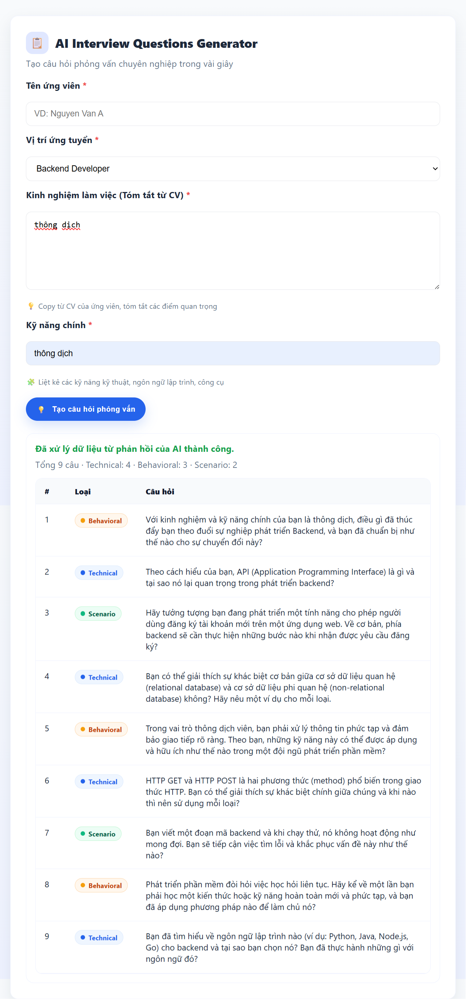

# 🤖 AI Recruitment Helper
Ứng dụng web tạo câu hỏi phỏng vấn tự động bằng AI (Gemini API) — xây dựng bằng Node.js + Express + HTML/CSS thuần.

<p align="center">
  
</p>

---

## 🚀 Tính năng chính
- Form nhập thông tin ứng viên (họ tên, vị trí, kinh nghiệm, kỹ năng)
- Tích hợp Google Gemini API để sinh câu hỏi phỏng vấn phù hợp
- Phân loại câu hỏi theo nhóm: Technical, Behavioral, Scenario
- Giao diện hiển thị bảng câu hỏi chuyên nghiệp, có màu sắc rõ ràng
- Xử lý được cả trường hợp AI trả JSON lỗi, hiển thị raw text gọn gàng
- Dễ chạy và mở rộng

---

## 🛠️ Công nghệ sử dụng
- Node.js + Express — Backend server
- Google Gemini API (Generative Language API)
- HTML + CSS + JavaScript thuần — Frontend UI
- dotenv — quản lý API key
- Fetch API — gọi API backend từ client

---

## ⚙️ Cách chạy project

1️⃣ Clone dự án
```bash
git clone https://github.com/ngannguyen19390506-droid/ai-recruitment-helper.git
cd ai-recruitment-helper

2️⃣npm install

3️⃣GOOGLE_API_KEY=YOUR_API_KEY_HERE

4️⃣node server.js

5️⃣http://localhost:3000

6️⃣ **📁 Cấu trúc thư mục**
Để người khác hiểu project của bạn có gì:
```markdown
## 📁 Cấu trúc thư mục
ai-recruitment-helper/
├── public/
│   ├── index.html        ← giao diện form + bảng câu hỏi
│   └── demo-ui.png       ← ảnh minh họa
├── server.js             ← server Express gọi Gemini API
├── test-gemini.mjs       ← file test API riêng
├── .env                  ← chứa GOOGLE_API_KEY (chưa push)
├── .env.example          ← mẫu env
├── .gitignore            ← loại bỏ node_modules, .env
├── package.json
└── README.md             ← mô tả, hướng dẫn chạy, ảnh demo


---

## 🧑‍💻 Tác giả
- **Như, Nguyên, Ngân**  
  GitHub: [@ngannguyen19390506-droid](https://github.com/ngannguyen19390506-droid)

---


## 📝 Ghi chú
- Không push file `.env` lên GitHub  
- Chạy Node v18+ để tránh lỗi fetch  
- Dự án phục vụ mục đích học tập và demo tích hợp AI
